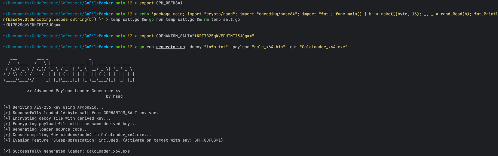
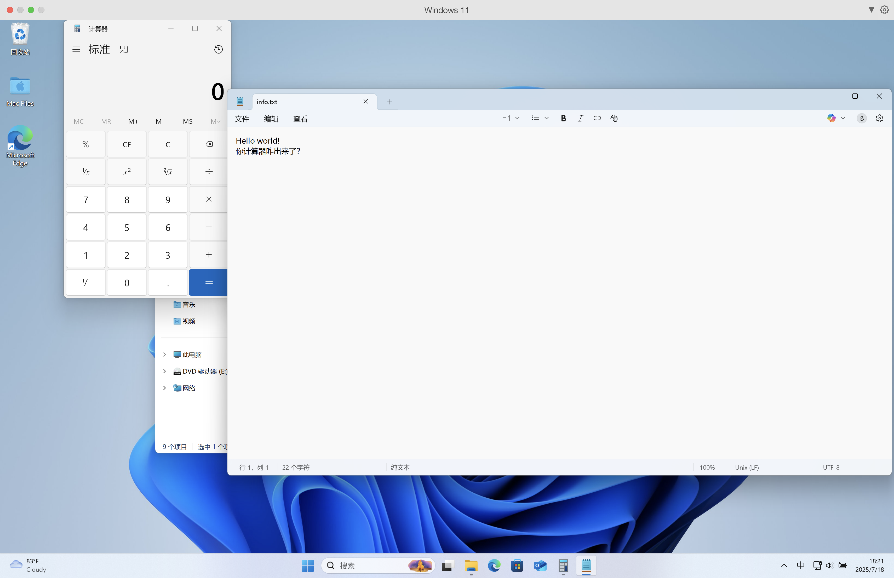

# GoPhantom

[](https://golang.org/)
[](https://opensource.org/licenses/MIT)
[](https://www.microsoft.com/windows)

**GoPhantom** 是一个为红队演练和安全研究设计的下一代荷载加载器（Payload Loader）生成器。它利用 Go 语言的强大功能，将原始的 Shellcode 和一个诱饵文件打包成一个独立的、具有较强免杀（AV-Evasion）能力的 Windows 可执行文件。

## 核心功能 (Key Features)

* 🛡️ **内存权限分离 (RW -> RX)**: 采用更隐蔽的内存操作，先申请 `PAGE_READWRITE` 内存写入荷载，完成后立即通过 `VirtualProtect` 切换为 `PAGE_EXECUTE_READ` 内存执行，规避常见的 EDR 行为告警。
* 🔑 **动态密钥派生**: 使用 **Argon2id** 从一个随机 Salt 派生出 AES-256 加密密钥。密钥本身永不存储在文件中，只在运行时派生。
* 😴 **睡眠混淆 (Sleep Obfuscation)**: 提供可选的运行时规避功能。在程序睡眠期间，使用一次性随机密钥加密内存中的荷载，以规避 EDR/杀软的内存扫描。
* decoy **诱饵文件**: 支持打包一个正常的诱饵文件（如 PDF、图片、文档），在执行恶意代码的同时打开它，以迷惑目标用户，提高社会工程学攻击的成功率。
* 🚀 **Fire and Forget**: 采用“发射后不管”的执行模式，Shellcode 在独立的线程中运行，不阻塞主程序，执行后立刻与主进程分离。
* 👻 **反沙箱技术**: 内置基础的反沙箱检测功能，通过检查物理内存大小和 CPU 核心数量来规避自动化分析环境。
* 📦 **优化编译**: 专为 `windows/amd64` 目标进行交叉编译，并使用 `ldflags` 优化选项 (`-s -w -H windowsgui`) 来减小最终文件体积、剥离符号信息并隐藏控制台窗口。
* ⚙️ **纯 Go 实现**: 生成器和加载器模板完全由 Go 语言编写，不依赖 CGO，保证了良好的可移植性和编译速度。

## 工作流程 (How it Works)

GoPhantom 的工作流程分为两个主要阶段：**生成阶段**和**执行阶段**。

### 1. 生成阶段 (`generator.go`)

在此阶段，你在自己的攻击机上运行 `generator.go` 来创建最终的加载器程序。

1.  **输入**: 接收一个原始 Shellcode 文件 (`payload.bin`) 和一个诱饵文件 (`decoy.pdf`)。
2.  **生成 Salt**: 程序自动生成一个随机的 16 字节 Salt（或从环境变量 `GOPHANTOM_SALT` 读取）。
3.  **派生密钥**: 使用 **Argon2id** 算法从 Salt 派生出一个 32 字节的 AES-256 密钥。
4.  **加密数据**: 使用此派生密钥和 AES-256-GCM 算法分别加密 Shellcode 和诱饵文件。
5.  **编码与注入**: 将加密后的数据和 **Salt** 转换为 Base64 字符串，并将其嵌入到一个预设的 Go 语言加载器模板中。
6.  **编译**: 调用 Go 编译器，将填充好数据的模板交叉编译成一个针对 `windows/amd64` 平台的 `.exe` 文件。

### 2. 执行阶段 (目标机器上的 `Final.exe`)

当目标用户运行你生成的 `.exe` 文件时，它会在后台执行以下操作：

1.  **环境检测**: 首先执行反沙箱检查，若不满足条件则直接退出。
2.  **派生密钥与解密**: 从自身读取 Salt，在内存中派生出 AES 密钥，并解密诱饵文件和 Shellcode。
3.  **释放诱饵**: 将解密的诱饵文件释放到公共目录并使用 `ShellExecute` 打开。
4.  **分配内存 (RW)**: 使用 `VirtualAlloc` 申请一块具有读写权限 (`PAGE_READWRITE`) 的内存空间。
5.  **写入荷载**: 将解密后的 Shellcode 复制到新分配的内存中。
6.  **睡眠混淆 (可选)**: 若 `GPH_OBFUS=1` 环境变量被设置，则在睡眠期间对内存中的荷载进行一次性加密和解密。
7.  **修改权限 (RX)**: 使用 `VirtualProtect` 将内存权限从 `PAGE_READWRITE` 修改为 `PAGE_EXECUTE_READ`。
8.  **注入执行**: 使用 `CreateThread` 创建一个新线程来执行荷载。
9.  **分离退出**: 主程序短暂延时后直接退出，实现“Fire and Forget”。

## 运行时选项 (Runtime Options)

### 启用睡眠混淆 (v1.2 新增)

v1.2 版本引入了睡眠混淆功能，可以有效对抗在程序挂起时对内存进行扫描的查杀技术。此功能默认关闭，需要通过环境变量手动开启。

**使用方法：**

在目标机器上执行最终生成的程序前，先设置环境变量 `GPH_OBFUS=1`。

* **在 PowerShell 中:**
    ```powershell
    $env:GPH_OBFUS=1
    ```
* **在 Linux / macOS 中:**
    ```bash
    export GPH_OBFUS=1
    ```

## 安装与使用 (Installation & Usage)

**要求**:
* Go 1.18 或更高版本。

**步骤**:

1. 克隆本仓库到你的本地机器：
   ```bash
   git clone https://github.com/watanabe-hsad/GoPhantom.git
   cd GoPhantom
   ```

2. 将你的原始 Shellcode (例如 `beacon.bin`) 和诱饵文件 (例如 `document.pdf`) 放入项目目录。

3. 运行 `generator.go` 并指定所需参数来生成加载器。

## 命令行参数 (Command-line Flags)

- `-decoy <file_path>`: **(必需)** 指定用作诱饵的文件的路径。
- `-payload <file_path>`: **(必需)** 指定原始 x64 Shellcode 文件的路径。
- `-out <file_name>`: **(可选)** 指定输出的可执行文件的名称。默认为 `FinalLoader.exe`。

## 使用方法 (Usage Example)

v1.1 版本引入了基于 Salt 的密钥派生机制，提供了两种使用模式。

### 模式一：简单模式 (默认)

此模式与旧版本用法完全相同，无需任何额外设置。程序会自动生成随机 Salt，确保每次生成的加载器都是独一无二的。

```bash
# 直接运行即可，程序会自动处理 Salt
go run generator.go -decoy "info.txt" -payload "calc_x64.bin" -out "hello.exe"
```

### 模式二：可复现模式 (高级)

此模式通过手动指定 Salt，可以实现**可复现构建**。只要输入文件和 Salt 不变，每次生成的 exe 文件就完全相同。

**第一步：生成你自己的 Salt**

为了确保在所有操作系统上都能成功生成 Salt，我们推荐使用以下“创建-运行-删除”的命令。它会自动完成所有操作并只输出最终的 Salt 字符串。

* **在 Linux / macOS / Git Bash 中运行:**
    ```bash
    echo 'package main; import "crypto/rand"; import "encoding/base64"; import "fmt"; func main() { b := make([]byte, 16); _, _ = rand.Read(b); fmt.Println(base64.StdEncoding.EncodeToString(b)) }' > temp_salt.go && go run temp_salt.go && rm temp_salt.go
    ```

* **在 Windows (CMD / PowerShell) 中运行:**
    ```cmd
    echo 'package main; import "crypto/rand"; import "encoding/base64"; import "fmt"; func main() { b := make([]byte, 16); _, _ = rand.Read(b); fmt.Println(base64.StdEncoding.EncodeToString(b)) }' > temp_salt.go && go run temp_salt.go && del temp_salt.go
    ```
    运行后，你会得到一串类似 `y5M3H+e8vU/HeaJg2w9bEA==` 的字符串。请复制它。


**第二步：设置环境变量并运行**

将上一步复制的 Salt 字符串设置为环境变量 `GOPHANTOM_SALT`，然后正常运行生成器。

* **示例 (Linux / macOS):**
    ```bash
    export GOPHANTOM_SALT="<粘贴你生成的Salt>"
    go run generator.go -decoy "info.txt" -payload "calc_x64.bin" -out "reproducible.exe"
    ```

* **示例 (Windows PowerShell):**
    ```powershell
    $env:GOPHANTOM_SALT="<粘贴你生成的Salt>"
    go run generator.go -decoy "info.txt" -payload "calc_x64.bin" -out "reproducible.exe"
    ```

**第三步：运行生成器**

正常运行生成器，它会自动检测并使用你提供的 Salt。

```bash
go run generator.go -decoy "info.txt" -payload "calc_x64.bin" -out "reproducible.exe"
```



### 步骤 2: 在目标机器执行

将 hello.exe 发送给目标并在 Windows 11 环境下执行。

程序会立刻打开诱饵文件 info.txt 来吸引用户的注意力，与此同时，作为核心荷载的计算器程序 (calc.exe) 已经在后台被成功唤起。



## 免责声明 (Disclaimer)

⚠️ **此工具仅限于授权的渗透测试、安全研究和教育目的。**

严禁将此工具用于任何非法活动。本项目的作者 (**hsad**) 不对任何因滥用或非法使用此工具而导致的直接或间接后果承担任何责任。用户应对自己的所有行为负责。

**使用本工具即表示您已阅读、理解并同意遵守此免责声明。**